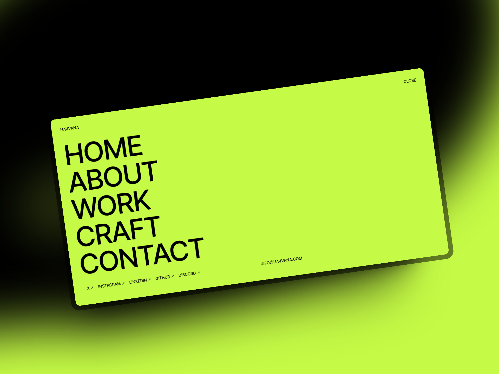

# Menu Overlay



## Local Setup

Clone the repository
```bash
git clone https://github.com/ibrahimraimi/nextjs-gsap-menu
```

#### Install dependencies

```bash
npm install
```

#### Run development server

```sh
npm run dev
```

## Resources

- [Gsap](https://gsap.com/docs/v3/Installation)
- [React & Gsap](https://gsap.com/resources/React/)

Note: Although I have Tailwind CSS installed for this experiment, I ultimately ended up using native CSS.
